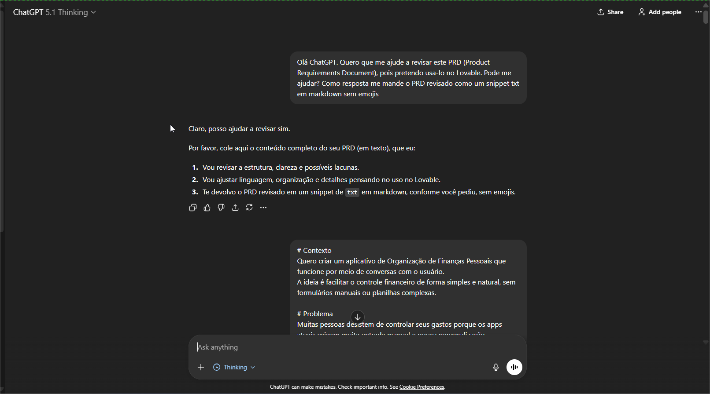
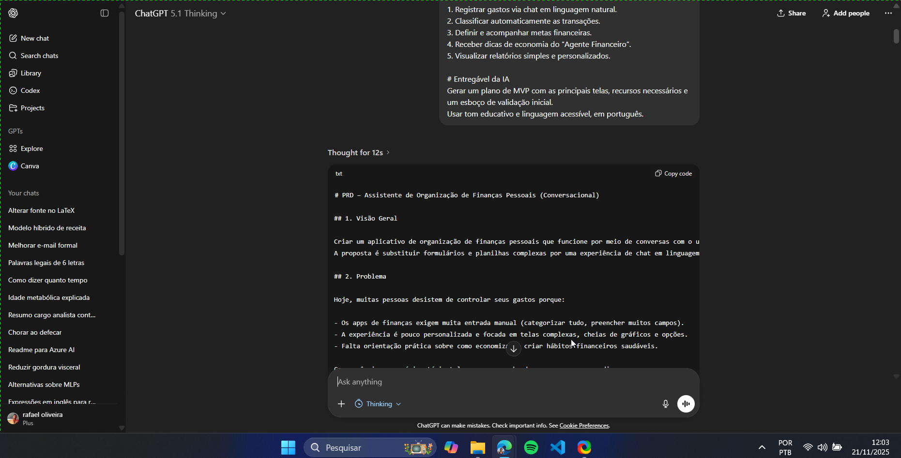
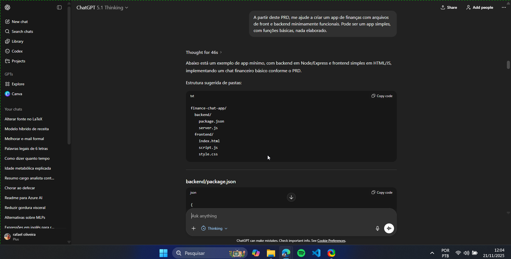
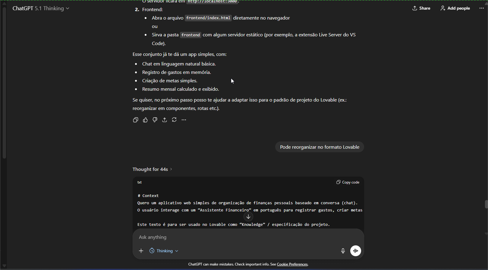
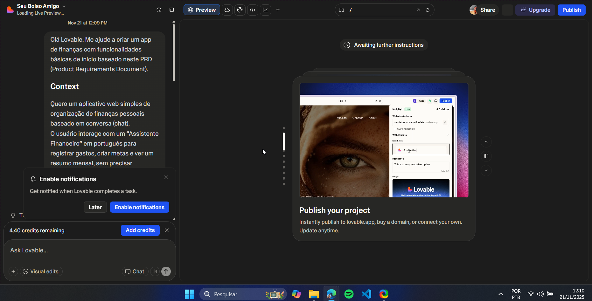
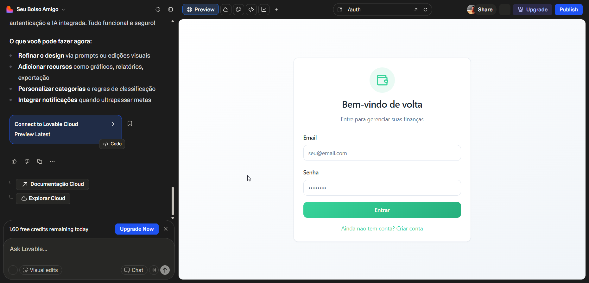
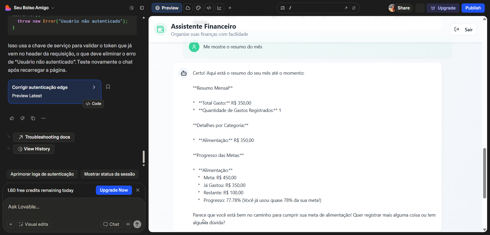

# 💸 App de Organização de Finanças Pessoais com Vibe Coding

Baseado no prompt presente no arquivo [prd.md](prd.md), criei o scopo do PRD para o app de finanças usando o ChatGPT.

A seguir, apresento algumas telas de interação com a IA na produção de um app minimamente funcional.

## Análise
  - O que funcionou bem?  
  - O que não funcionou como o esperado?  
  - O que aprendeu sobre conversar com IAs?
